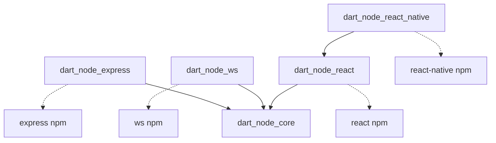
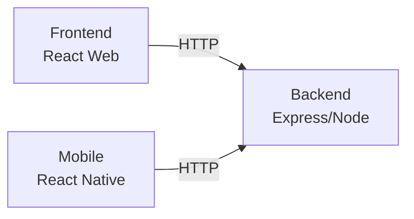

# dart_node

Write your entire stack in Dart: React web apps, React Native mobile apps with Expo, and Node.js Express backends.

## Package Architecture



## Packages

| Package | Description | Version |
|---------|-------------|---------|
| [dart_node_core](packages/dart_node_core) | Core JS interop utilities | 0.1.0-beta |
| [dart_node_express](packages/dart_node_express) | Express.js bindings | 0.1.0-beta |
| [dart_node_ws](packages/dart_node_ws) | WebSocket bindings | 0.1.0-beta |
| [dart_node_react](packages/dart_node_react) | React bindings | 0.1.0-beta |
| [dart_node_react_native](packages/dart_node_react_native) | React Native bindings | 0.1.0-beta |

## Example Quick Start

**Web + Backend:**
```bash
./run_dev.sh
```
Open http://localhost:8080/web/

**Mobile:** Use VSCode launch config `Mobile: Build & Run (Expo)`



- **Backend**: Express server on port 3000 (Dart → Node.js)
- **Frontend**: React app on port 8080 (Dart → Browser JS)
- **Mobile**: Expo app (Dart → React Native)

## License

BSD 3-Clause License. Copyright (c) 2025, Christian Findlay.
