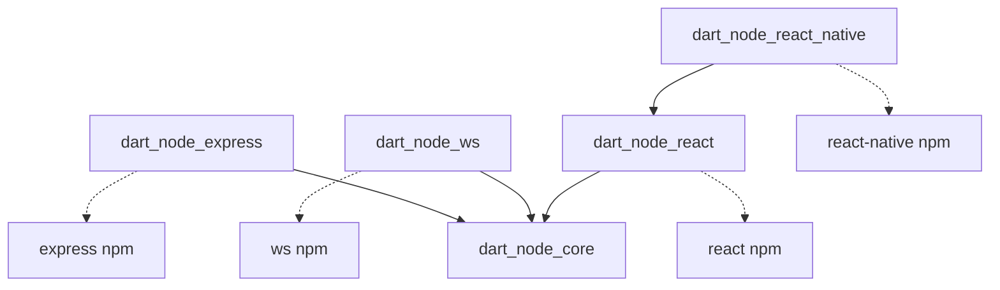

# dart_node_express

Express.js bindings for Dart. Build Node.js HTTP servers and REST APIs entirely in Dart with full type safety.

Write your entire stack in Dart: React web apps, React Native mobile apps with Expo, and Node.js Express backends.

## Package Architecture

Part of the [dart_node](https://github.com/MelbourneDeveloper/dart_node) package family.
